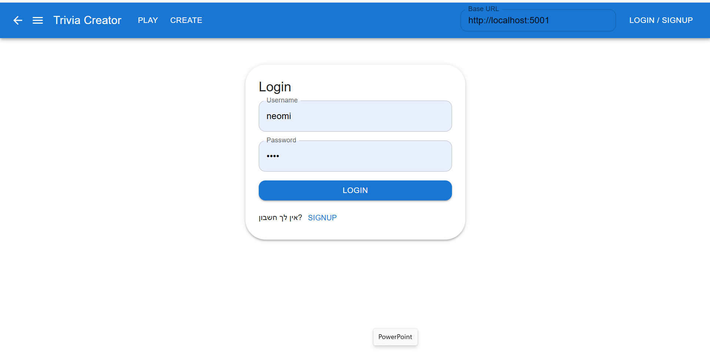
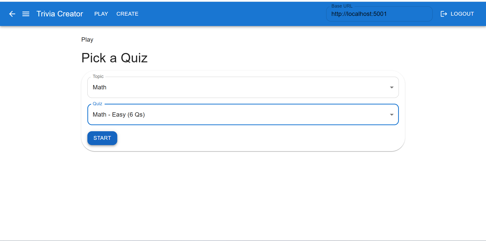
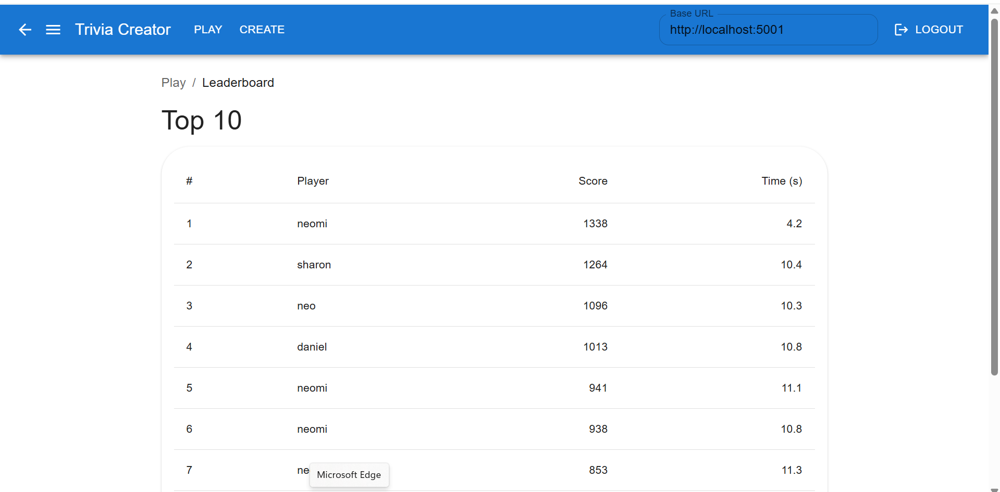
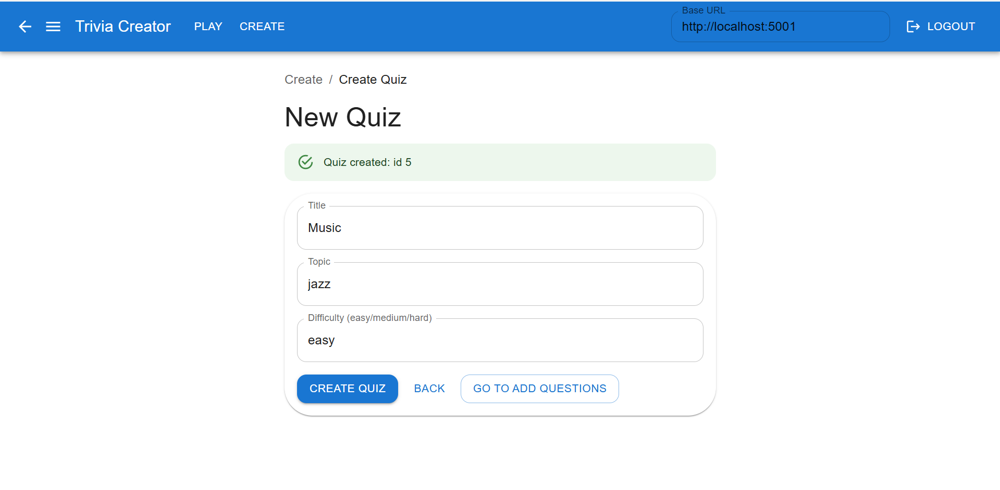
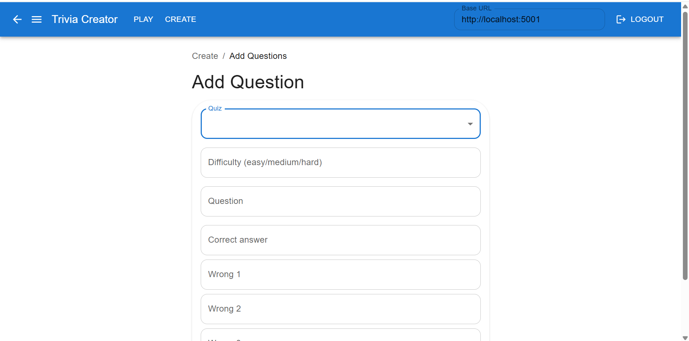

Trivia Creator 🎮

A fullstack trivia game built with Flask (backend) and React (frontend).
Players can sign up, create quizzes, play timed sessions, and compete on the leaderboard.

Users: signup/login (hashed passwords)

Quizzes: list by topic, create, add questions, bulk import

Game sessions: per-question timing on the client (sends client_ms); total time is stored and used as a tie-breaker

Leaderboard: top scores per quiz (tie-break by total duration)

CORS ready (Vite/CRA)

SQLite for dev / Postgres via DATABASE_URL

## Tech Stack
- **Backend**: Python, Flask, Flask-CORS, SQLAlchemy, Flask-Migrate, python-dotenv
- **Frontend**: React (Vite), Material UI (optional styling)
- **Database**: SQLite (local) / Postgres (via `DATABASE_URL`)
- **Other**: Alembic migrations, dotenv for config

Project Structure

├─ backend/
│  ├─ app.py                      # Flask app factory, registers blueprints, CORS, DB, Migrate
│  ├─ models.py                   # SQLAlchemy models (User, Quiz, TriviaQuestion, QuizSession, QuizAnswerLog, LeaderboardEntry)
│  ├─ routes/
│  │  ├─ __init__.py              # (optional) routes aggregator
│  │  ├─ users.py                 # /users: signup, login, (optional) list
│  │  └─ library.py               # /library: topics, quizzes CRUD-lite, import, sessions, leaderboard
│  ├─ utils/
│  │  ├─ db.py                    # Shared SQLAlchemy() instance and init helpers
│  │  └─ helpers.py               # JSON helpers (j_ok/j_err), normalization, etc.
│  ├─ data/
│  │  └─ seed_quizzes.json        # Example quizzes (safe to commit)
│  ├─ tools/
│  │  └─ seed_json.py             # Simple seeder: POSTs seed_quizzes.json to the API
│  ├─ migrations/                 # Alembic (Flask-Migrate) — keep or ignore versions per repo policy
│  └─ instance/
│     └─ .gitkeep                 # Local SQLite lives here as users.db (not committed)

├─ frontend/
│  ├─ src/
│  │  ├─ App.tsx                  # App root, routes, theme; reads API base from env/LocalStorage
│  │  ├─ auth/
│  │  │  └─ RequireAuth.tsx       # Guard: redirects to /login if not authenticated
│  │  ├─ components/
│  │  │  ├─ Navbar.tsx            # Top bar with Base URL input, nav links, logout
│  │  │  └─ Crumbs.tsx            # Small breadcrumbs helper
│  │  ├─ hooks/
│  │  │  └─ useApi.ts             # Tiny fetch wrapper (get/post returning {ok,data|error})
│  │  ├─ utils/
│  │  │  └─ time.ts               # TIME_LIMIT_SEC, msToSec, etc.
│  │  ├─ types/
│  │  │  └─ index.ts              # Shared types (e.g., LeaderRow)
│  │  └─ pages/
│  │     ├─ AuthPageInline.tsx    # Login/Signup screen (toggle)
│  │     ├─ play/
│  │     │  ├─ PlayPicker.tsx     # Topic + Quiz picker, starts session
│  │     │  ├─ GameScreen.tsx     # Full-screen game; stable per-question timer; submits answers
│  │     │  └─ LeaderboardScreen.tsx # Top scores table (score + duration)
│  │     └─ create/
│  │        ├─ CreateHome.tsx     # Two big buttons: Create Quiz / Add Questions
│  │        ├─ CreateQuizForm.tsx # Create quiz (title/topic/difficulty)
│  │        └─ AddQuestionForm.tsx# Add question to an existing quiz
│  ├─ public/
│  │  └─ screenshots/             # Optional screenshots used in README
│  ├─ package.json                # Frontend dependencies & scripts
│  └─ vite.config.ts              # Vite config (aliases, env define)

├─ .env                           # Local env (not committed) — includes VITE_API_BASE_URL, Flask vars
├─ .env.example                   # Safe template shared with teammates
├─ requirements.txt               # Backend deps (Flask, SQLAlchemy, Migrate, etc.)
├─ README.md
└─ .gitignore                     # Single repo-wide ignore for frontend + backend

Backend — Setup & Run

All commands below are from the backend/ folder.

1) Create & activate venv + install deps

Windows PowerShell

cd backend
python -m venv .venv
.\.venv\Scripts\Activate.ps1
pip install -r ..\requirements.txt

macOS/Linux

cd backend
python3 -m venv .venv
source .venv/bin/activate
pip install -r ../requirements.txt

2) Initialize/upgrade DB (migrations)
# Windows/macOS/Linux (from backend with venv active)
$env:FLASK_APP="app:create_app"  # PowerShell
# export FLASK_APP=app:create_app # bash/zsh

# First-time project
flask db upgrade

If you ever change models, do:

flask db migrate -m "describe change"
flask db upgrade

Reset dev DB (if needed):

# Danger: deletes local DB only (SQLite)
Remove-Item -Force .\instance\users.db     # Windows
# rm -f instance/users.db                  # macOS/Linux
flask db upgrade

3) Run dev server
python app.py

Runs on: http://localhost:5001

Health check: GET / → {"ok": true, "db": "<engine url>"}

Seeding Example Data

The repo ships with backend/data/seed_quizzes.json and a small seeder:

# In another terminal (while the backend is running)
cd backend
.\.venv\Scripts\Activate.ps1   # if needed
python tools/seed_json.py

If successful:

Status: 201
{"ok":true,"data":{"created":[...]} }

The seeder POSTs to POST /library/import with the JSON payload.

Frontend — Setup & Run

From frontend/:

npm install
npm run dev

Runs on: http://localhost:5173

The app reads the backend URL from the **root** `.env` via `VITE_API_BASE_URL`.
You can override it at runtime in the navbar’s “Base URL” field (it’s stored in localStorage).
After changing `.env`, restart `npm run dev`.

The App.tsx already calls backend endpoints at http://localhost:5001 by default (you can edit the “Base URL” field in the navbar at runtime).

API (Quick Reference)
Users (/users)

POST /users/signup → { username, password } → { id, username }

POST /users/login → { username, password } → { user_id, username }

GET /users/ → list (optional)

Library & Game (/library)

GET /library/topics

GET /library/quizzes?topic=...

GET /library/quizzes/<quiz_id>

POST /library/quizzes → create ({ title, topic, difficulty? })

POST /library/questions → add ({ quiz_id, question, difficulty?, answers[4] })
Note: answers[0] is the correct answer.

POST /library/import → bulk import (uses the same JSON schema as data/seed_quizzes.json)

POST /library/session/create → { player_name, quiz_id } → { session_id }

GET /library/session/<sid>/current → current Q (options shuffled)

POST /library/session/<sid>/answer → { answer, client_ms }

scoring: awarded = max(100, 1000 - client_ms/2) if correct; else 0

server aggregates total time across the session to LeaderboardEntry.duration_ms

GET /library/leaderboard?quiz_id=... → top 10
Sorted by score desc, then duration_ms asc, then id asc

Response envelope (normalized):

{ "ok": true,  "data": ... }
{ "ok": false, "error": { "code": "bad_request", "message": "..." } }

Timer & Scoring (How it works)

The frontend starts a per-question timer (performance.now()) when it receives the question.

On answer, it POSTs client_ms to /library/session/<sid>/answer.

The backend:

checks correctness against answers[0]

calculates awarded points using client_ms

logs the answer to QuizAnswerLog

when the session finishes, aggregates total time (sum of client_ms) and writes LeaderboardEntry(duration_ms).

The frontend shows:

current score while playing

on finish: final score and can (optionally) show total time from leaderboard (already stored server-side)

Already wired in App.tsx: “Play Again / Back” UX to restart smoothly.

Onboarding for Teammates (TL;DR)
git clone <repo>
cd Game_maker

# Backend
cd backend
python -m venv .venv
.\.venv\Scripts\Activate.ps1
pip install -r requirements.txt
flask db upgrade
python app.py

# (optional) Seed example data – in another terminal while backend runs:
python tools/seed_json.py

# Frontend
cd ..\frontend
npm install
npm run dev

Troubleshooting

ModuleNotFoundError: No module named 'flask'
venv not active / deps missing. Activate and pip install -r requirements.txt.

OperationalError: no such table: ...
Run flask db upgrade. If still failing and you’re on local dev, delete backend/instance/users.db and upgrade again.

Target database is not up to date.
Run flask db upgrade. If the DB is already correct but Alembic is confused, run flask db stamp head.

no such column: user.created_at
You added created_at to the model after the DB existed. Create a migration (flask db migrate -m "add created_at") and flask db upgrade.
For dev only, you can reset the SQLite file and upgrade.

Roadmap by Phases

Phase 1 — Core (✅)

User signup/login (hash)

Create quizzes & add questions

Single-player session flow

Leaderboard (score + time)

Phase 2 — Enhancements (▶ in progress)

JWT auth (tokens)

Admin actions: delete quizzes / topics

Better error handling/helpers

JSON import UX

Phase 3 — Advanced (🗺 planned)

Docker deployment

Multiplayer / realtime

Frontend filters (category/difficulty)

Demo screenshots/GIFs

## 📸 Demo

Below are some example screenshots from the project:

### Login/sign in Page

### Quiz Selection

### Playing a Quiz

### Leaderboard

### Create a New Quiz

### Create a New Question

